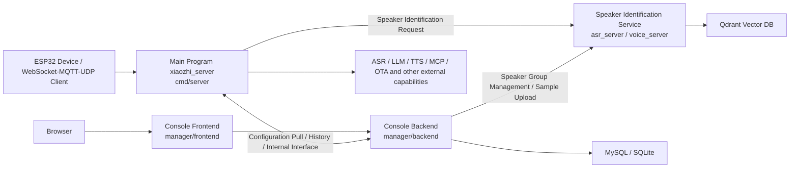

# Compilation and Deployment Guide

This document is for developers who need to compile, debug and deploy this project from source, organizing the compilation and deployment methods for the main program, console front and back ends, and speaker identification service.

It is recommended to use this document in the following reading order:

- First look at the overall architecture to clarify the location and calling relationships of each service
- Then complete compilation and deployment in the order of Main Program -> Console Backend -> Console Frontend -> Speaker Identification Service
- Finally, if you need to create an integrated release package, see the AIO packaging process at the end of the document

This document prioritizes introducing the method of compiling and deploying each service separately; the AIO form is explained separately at the end.

## 1. Service Split Description

For daily development, debugging, and separately replacing a service, it is recommended to use the separated deployment form:

- Main program: `cmd/server`
- Console backend: `manager/backend`
- Console frontend: `manager/frontend`
- Speaker identification service: `asr_server` submodule

These four parts are compiled and started separately, most suitable for development debugging.

The integrated AIO packaging method is placed in the second half of this document, suitable for release packages or delivery packages.

## 2. Overall Architecture



### 2.1 Position of Each Service in Architecture

| Service | Code Directory | Main Responsibility | Common Ports |
| --- | --- | --- | --- |
| Main Program | `cmd/server` | Device access, session orchestration, ASR/LLM/TTS scheduling, OTA, WebSocket/MQTT/UDP | `8989` / `2883` / `8990` |
| Console Backend | `manager/backend` | Management API, configuration management, history, speaker group management | `8080` |
| Console Frontend | `manager/frontend` | Management page, configuration wizard, testing tools | Development state `3000` |
| Speaker Identification Service | `asr_server` | Speaker registration, identification, verification, streaming interface | Source code default `9000` |

### 2.2 Key Address Alignment Relationships

When deploying separately, the following four addresses must be aligned:

| Call Direction | Configuration Item | Typical Value |
| --- | --- | --- |
| Frontend -> Backend | `VITE_API_TARGET` | `http://127.0.0.1:8080` |
| Main Program -> Console Backend | `config/config.yaml` -> `manager.backend_url` | `http://127.0.0.1:8080` |
| Console Backend -> Speaker Identification Service | `manager/backend/config/config.json` -> `speaker_service.url` or `SPEAKER_SERVICE_URL` | `http://127.0.0.1:9000` |
| Main Program -> Speaker Identification Service | `config/config.yaml` -> `voice_identify.base_url` | `http://127.0.0.1:9000` |

## 3. Environment Preparation

### 3.1 Pull Code and Submodules

Speaker identification service is a Git submodule, please execute after first pull:

```bash
git submodule update --init --recursive
```

If you are newly cloning the repository, it is recommended to directly:

```bash
git clone --recursive <repo-url>
```

### 3.2 Recommended Tool Versions

- Go: `1.24.x`, consistent with `1.24.4` in CI
- Node.js: `20.x`
- npm: Follow Node 20

### 3.3 Linux Local Compilation Common Dependencies

Both main program and speaker identification service involve CGO, ONNX Runtime or ten-vad dynamic libraries. Ubuntu can refer to:

```bash
sudo apt-get update
sudo apt-get install -y pkg-config libopus0 libopusfile-dev libc++1 libc++abi1
```

Main program local source compilation also needs to install ONNX Runtime 1.21.0. Steps can directly refer to the "Local Compilation" chapter in the root directory `README.md`.

### 3.4 Recommended Infrastructure to Prepare First

- MySQL: Used when console backend uses MySQL
- Qdrant: Used when speaker identification service uses `qdrant` storage

If just for local functional verification:

- Console backend can first use SQLite
- Speaker identification service can first use JSON storage

## 4. Separate Deployment: Compilation and Deployment of Each Service

### 4.1 Main Program

Code directory: `cmd/server`

### Key Configuration

Configuration file default location:

```text
config/config.yaml
```

Most commonly changed in source code deployment:

- `manager.backend_url`
- `websocket.host` / `websocket.port`
- `mqtt_server.listen_port`
- `udp.listen_port`
- `voice_identify.enable`
- `voice_identify.base_url`

If using separate deployment, it is recommended to first correct the following two items:

```yaml
manager:
  backend_url: "http://127.0.0.1:8080"

voice_identify:
  enable: true
  base_url: "http://127.0.0.1:9000"
```

### Compilation

```bash
go mod tidy
go build -o xiaozhi_server ./cmd/server
```

### Startup

```bash
./xiaozhi_server -c config/config.yaml
```

### Deployment Suggestions

1. In separate deployment mode, the main program itself is not responsible for managing console front and back ends and speaker identification service processes.
2. Before main program startup, it is recommended that the console backend is already accessible, otherwise `manager` configuration provider will fail when pulling configuration.
3. If devices go through WebSocket, the core access address is usually `ws://<host>:8989/xiaozhi/v1/`.

### 4.2 Console Backend

Code directory: `manager/backend`

### Key Configuration

Configuration file default location:

```text
manager/backend/config/config.json
```

Focus on:

- `database.type`: `mysql` or `sqlite`
- `database.mysql` / `database.sqlite`
- `speaker_service.url`
- `history.audio_base_path`

Supported environment variable overrides:

- `DB_HOST`
- `DB_PORT`
- `DB_USER`
- `DB_PASSWORD`
- `DB_NAME`
- `SPEAKER_SERVICE_URL`
- `AUDIO_BASE_PATH`

### Compilation

```bash
cd manager/backend
go mod tidy
go build -o main .
```

### Startup

```bash
cd manager/backend
./main -c config/config.json
```

Can also run directly in development state:

```bash
cd manager/backend
go run main.go -c config/config.json
```

### Deployment Suggestions

1. For local debugging, prioritize using SQLite to reduce dependencies.
2. When debugging speaker identification functions, please ensure `speaker_service.url` points to the speaker identification service.
3. After console backend startup, both main program and frontend should point to this service.

### 4.3 Console Frontend

Code directory: `manager/frontend`

Console frontend is mainly used for local development debugging. First install dependencies then start the development server:

```bash
cd manager/frontend
npm ci
npm run dev
```

Default development address:

- Frontend page: `http://127.0.0.1:3000`
- API proxy target: `http://127.0.0.1:8080`

If you need to modify the proxy target, you can set:

```bash
VITE_API_TARGET=http://127.0.0.1:8080
```

Or modify `manager/frontend/.env`.

### 4.4 Speaker Identification Service

Code directory: `asr_server`

### Key Description

`asr_server` is a submodule. When running source code separately, it defaults to reading:

```text
asr_server/config.json
```

The default port in the current submodule configuration is `9000`. In actual deployment, it must be consistent with the speaker identification service address in the main program and console backend.

### Key Configuration

Focus on:

- `server.port`
- `speaker.enabled`
- `speaker.storage_type`
- `speaker.qdrant.host`
- `speaker.qdrant.port`
- `speaker.qdrant.collection_name`
- `speaker.model_path`

Common choices:

1. Development debugging: `speaker.storage_type = "json"`
2. Production deployment: `speaker.storage_type = "qdrant"`

### Source Compilation

Linux / macOS:

```bash
cd asr_server
go mod tidy
CGO_ENABLED=1 go build -o voice_server main.go
```

Windows PowerShell:

```powershell
cd asr_server
$env:CGO_ENABLED=1
go mod tidy
go build -o voice_server.exe main.go
```

### Startup

Linux / macOS:

```bash
cd asr_server
export LD_LIBRARY_PATH="$PWD/lib:$PWD/lib/ten-vad/lib/Linux/x64:${LD_LIBRARY_PATH:-}"
./voice_server
```

Windows:

```powershell
cd asr_server
.\voice_server.exe
```

### Deployment Suggestions

1. For local development, first use JSON storage to run through interfaces, then switch to Qdrant.
2. If main program enables `voice_identify.enable=true`, please synchronously modify `voice_identify.base_url` in the main program.
3. `speaker_service.url` in console backend must also point to the same speaker identification service address.

### 4.5 Recommended Startup Order

This document introduces in the order of "Main Program -> Console Backend -> Console Frontend -> Speaker Identification Service", but actual startup is recommended to follow dependency order:

1. MySQL / SQLite
2. Qdrant
3. Speaker Identification Service `asr_server`
4. Console Backend `manager/backend`
5. Main Program `cmd/server`
6. Console Frontend `manager/frontend`

## 5. AIO Packaging Process Consistent with Release

If your goal is to replicate the current repository's release package, rather than separate deployment, it is recommended to execute according to CI thinking.

Before starting AIO packaging, please first confirm that you have understood and run through the separate deployment process in Chapter 4.

The current repository's AIO form will first build the frontend, then through Go build tags, bundle the following capabilities into the main program:

- `manager`
- `asr_server`
- `embed_ui`

Therefore, the final product's `xiaozhi_server` is actually "Main Program + Console Backend + Speaker Identification Service + Embedded Console Frontend".

### 5.1 Frontend Build First

```bash
cd manager/frontend
npm ci
npm run build
```

Then copy frontend build products to the backend static directory:

```bash
mkdir -p ../backend/static/dist
cp -r dist/* ../backend/static/dist/
```

### 5.2 Compile Main Program with Embedded Services

Return to repository root directory and execute:

```bash
go mod tidy
go build -tags "nolibopusfile asr_server manager embed_ui" -ldflags "-s -w" -o xiaozhi_server ./cmd/server
```

### 5.3 Start AIO Package

CI packaging will place the following files together in the release directory:

- `main_config.yaml`
- `manager.json`
- `asr_server.json`
- `models/`
- `data/`

When running manually locally, you can refer to:

```bash
./xiaozhi_server \
  -c main_config.yaml \
  -manager-config manager.json \
  -asr-config asr_server.json
```

### 5.4 AIO Packaging Supplementary Description

Actual release usually also additionally completes:

- ten-vad / sherpa-onnx runtime library packaging
- `models/`, `data/`, example configuration copying
- Platform directory renaming and compression

## 6. Simple Usage Instructions After Overall Deployment

### 6.1 Open Console

After deployment is complete, browser access:

```text
http://<Server IP or Domain>:8080
```

If front and back ends are separated and no unified reverse proxy is done, please access according to your frontend publishing port.

### 6.2 Complete Basic Configuration

After first entry, it is recommended to complete according to the console configuration wizard:

1. OTA address
2. VAD configuration
3. ASR configuration
4. LLM configuration
5. TTS configuration

### 6.3 Verify Speaker Identification Service

If speaker identification is needed:

1. Create speaker group in console
2. Upload sample audio
3. Confirm console backend can access speaker identification service
4. Confirm main program's `voice_identify.enable=true`
5. Confirm main program's `voice_identify.base_url` points to correct address

### 6.4 Connect Device

Common device access information is as follows:

- WebSocket: `ws://<host>:8989/xiaozhi/v1/`
- OTA interface: `http://<host>:8989/xiaozhi/ota/`
- MQTT: `<host>:2883`
- UDP: `<host>:8990`

### 6.5 Minimum Debug Loop

It is recommended to do a smoke verification in the following order:

1. Open console, confirm page can load.
2. Complete a set of usable VAD / ASR / LLM / TTS configurations in the console.
3. Confirm main program logs have successfully pulled console configuration.
4. If speaker identification is enabled, first upload samples in console, then test identification.
5. Let devices obtain WebSocket or MQTT/UDP addresses through OTA and connect to main program.

## 7. Common Pitfalls

### 7.1 Speaker Identification Service Address Inconsistent

The most common problem is that the following two addresses were not changed simultaneously:

- `manager/backend/config/config.json` -> `speaker_service.url`
- `config/config.yaml` -> `voice_identify.base_url`

### 7.2 Forgot to Initialize Submodule

If `asr_server/server/setup.go` does not exist, it means the submodule was not pulled down, and both AIO compilation and Release compilation will fail.

### 7.3 Mixed "Separate Deployment" and "AIO Package"

Please remember:

- Separate deployment: Four services are built and run separately
- AIO packaging: Frontend, backend, and speaker identification service are compiled together into `xiaozhi_server`

First determine the target form, then decide the build command and configuration files.
