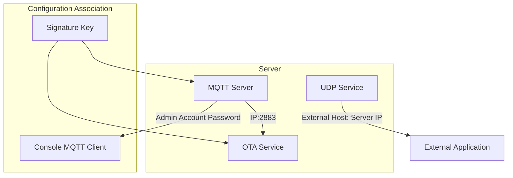
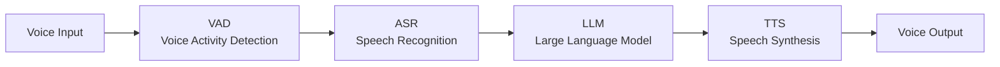

# ESP32 Xiaozhi AI Backend Deployment and Usage Guide
This guide provides the complete deployment process for using this project as a backend on ESP32, including three major parts: server deployment, device configuration, and console configuration.
## 1. Server Deployment
There are two server deployment methods: local deployment and Docker deployment.
### Docker Deployment
You can deploy via Docker in the following two ways:
*   **Method 1 (Recommended - Includes Console)**: [Docker Compose Quick Start »](doc/docker_compose.md)
*   **Method 2 (Pure Service, No Console)**: [Docker Quick Start »](doc/docker.md)

**Important Notes:**
*   The `docker-compose` command is a tool independent of Docker Engine. If you are using a newer version of Docker, you can also directly use the `docker compose` command (a subcommand of the `docker` CLI), both have equivalent functionality.

**Service Port Mapping Description:**
After deployment, container service ports will be mapped to the host. Default configuration is as follows:
*   **`8989:8989`**: WebSocket service port.
*   **`2883:2883`**: MQTT service port.
*   **`8888:8888/udp`**: UDP service port.

### Local Deployment
Refer to README.md

## 2. Configure ESP32 OTA Update Address

ESP32 devices support two methods to configure the OTA server address:

### Method 1: Modify via WiFi Configuration (Applicable after device deployment)

This method requires modification through the device's Web configuration interface.

**Operation Steps:**
1.  Start the ESP32 device to enter WiFi configuration mode (manifested as opening an AP hotspot).
2.  Use a phone or computer to connect to this hotspot and access its configuration page in the browser (address is usually `192.168.4.1`).
3.  Find the **OTA** related options on the page.
4.  Modify the OTA server address to: `http://<Your Server IP>:8989/xiaozhi/ota/`
    **Example**: `http://192.168.1.12:8989/xiaozhi/ota/`
5.  Save configuration and configure network.

### Method 2: Modify via Compilation Configuration

This method requires recompiling the ESP32 firmware and modifying the project configuration file to preset the OTA address.

**Operation Steps:**
1.  In your ESP32 project directory, find the corresponding location of the configuration file `config.json`.
2.  Add or modify the OTA server address configuration item:
    ```json
    "CONFIG_OTA_URL": "http://<Your Server IP>/xiaozhi/ota/"
    ```

## 3. Console Configuration
### Service Configuration


#### OTA Configuration
Change the signature key to match the 'Signature Key' in the mqtt server configuration page
Can choose whether to enable MQTT configuration. If enabled, set MQTT endpoint to Server IP:2883
#### MQTT Configuration
If using built-in MQTT broker, change the Broker address to 127.0.0.1 and port to 2883
If using external MQTT, modify as needed
Change the authentication configuration to the admin account and password in MQTT Server configuration

#### MQTT Server Configuration
Set the listening port to 2883
Set admin user and password
Set the signature key to match the signature key in the ota configuration page

#### UDP Configuration
Set the listening port to 8888
Set the external host to your server IP, e.g., 192.168.1.12
#### MCP Configuration
Global MCP server is an external MCP server. If there is no external MCP server, it can be left unconfigured temporarily

### AI Configuration

#### VAD Configuration
Use WebRTC VAD, no external configuration needed
#### ASR Configuration
Fill in the ASR configuration. Even if the server is deployed via docker, there is no locally deployed ASR, so you can deploy it manually.
Deployment tutorial reference [FunASR Real-time Speech Transcription Service Development Guide](https://github.com/modelscope/FunASR/blob/main/runtime/docs/SDK_advanced_guide_online_zh.md)
#### LLM Configuration
Fill in your own APIKEY
#### TTS Configuration
Note: Xiaozhi TTS is no longer working properly, recommend using edge
