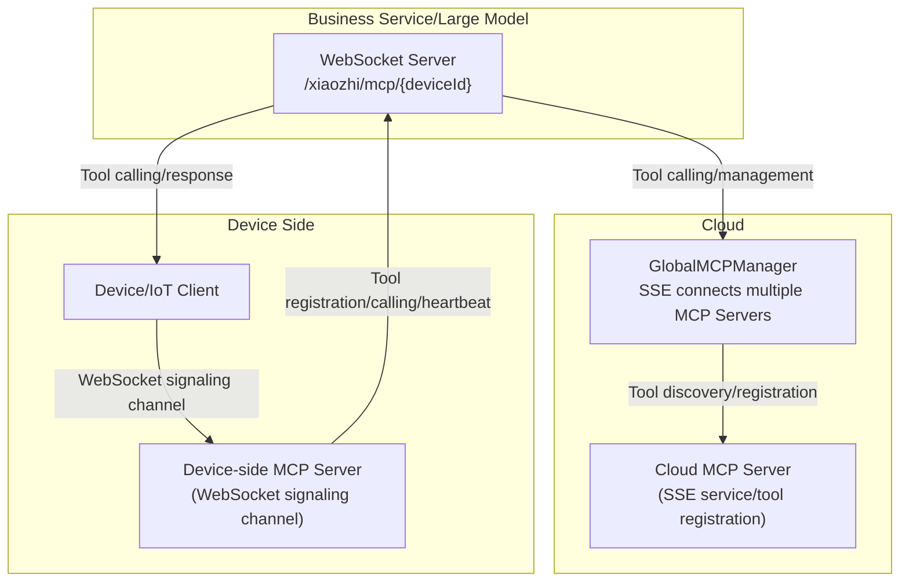

# MCP Features and Logic Documentation

## 1. Overview
MCP (Model Context Protocol) is a general tool management and calling protocol implemented based on the [Eino framework](https://github.com/cloudwego/eino), supporting global and device dimension tool registration, discovery, and calling, widely used in AI dialogue, IoT and other scenarios.

## 2. Feature Characteristics
### 🌐 Global MCP Tool Management
- Support connecting multiple MCP servers via SSE, achieving automatic tool discovery and registration
- Tool calling proxy, unified interface
- Connection status monitoring and automatic reconnection

### 📱 Device Dimension MCP Management
- Each device has independent MCP connection, supports WebSocket protocol
- Device-specific tool registration and management
- Connection limit and automatic cleanup

### 🔧 Eino Framework Integration
- Implements `tool.InvokableTool` interface, supports Eino native tool calling
- Type-safe, streaming processing

## 3. Architecture Design



## 4. Configuration Instructions

### config.yaml Example
```yaml
mcp:
  global:
    enabled: true
    servers:
      - name: "filesystem"
        sse_url: "http://localhost:3001/sse"
        enabled: true
    reconnect_interval: 5
    max_reconnect_attempts: 10
  device:
    enabled: true
    websocket_path: "/xiaozhi/mcp/"
    max_connections_per_device: 5
```

### Parameter Description
| Parameter | Type | Description |
|------|------|------|
| mcp.global.enabled | bool | Whether to enable global MCP manager |
| mcp.global.servers | array | MCP server list |
| mcp.global.reconnect_interval | int | Reconnection interval (seconds) |
| mcp.global.max_reconnect_attempts | int | Maximum reconnection attempts |
| mcp.device.enabled | bool | Whether to enable device MCP manager |
| mcp.device.websocket_path | string | WebSocket path prefix |
| mcp.device.max_connections_per_device | int | Maximum connections per device |

## 5. API Interfaces
### WebSocket Endpoint
- Device MCP connection:
  - `ws://<host>:<port>/xiaozhi/mcp/{deviceId}`
  - After connection, server sends initialization message, client responds with tool list, establishing bidirectional communication
- Message format example:
```json
{
  "jsonrpc": "2.0",
  "method": "tools/list",
  "id": 1,
  "params": {}
}
```

### REST Interface
- Get device tool list:
  - `GET /xiaozhi/api/mcp/tools/{deviceId}`
  - Response example:
```json
{
  "deviceId": "device123",
  "tools": {
    "filesystem_read_file": { "name": "read_file", "description": "Read file content", "type": "global" },
    "device_sensor_data": { "name": "sensor_data", "description": "Get sensor data", "type": "device" }
  },
  "globalCount": 5,
  "deviceCount": 3,
  "totalCount": 8,
  "timestamp": 1704067200
}
```

## 6. Typical Usage Examples
### Go-side Call
```go
// Get global tools
manager := mcp.GetGlobalMCPManager()
tools := manager.GetAllTools()
for name, tool := range tools {
    result, err := tool.InvokableRun(context.Background(), `{"path": "/tmp/test.txt"}`)
    if err != nil {
        log.Errorf("Tool call failed: %v", err)
        continue
    }
    log.Infof("Tool %s result: %s", name, result)
}
```

### Device-side WebSocket Connection (JS)
```javascript
const ws = new WebSocket('ws://localhost:8989/xiaozhi/mcp/device123');
ws.onopen = function() { console.log('MCP connection established'); };
ws.onmessage = function(event) {
    const message = JSON.parse(event.data);
    if (message.method === 'initialize') {
        ws.send(JSON.stringify({
            jsonrpc: "2.0",
            id: message.id,
            result: {
                protocolVersion: "2024-11-05",
                serverInfo: { name: "device-mcp-server", version: "1.0.0" }
            }
        }));
    }
};
```

## 7. Technical Implementation Points
- Global MCP manager connects to multiple MCP servers via SSE, automatically discovers and registers tools, supports disconnection reconnection and health checking.
- Device MCP manager maintains independent connections for each device, supports WebSocket and IoT protocols, automatically cleans up offline devices.
- Tools uniformly implement `InvokableTool` interface, supports parameter validation, calling retry, result formatting.
- When LLM integrates, automatically gets all MCP tools and passes them to large model, supports streaming response and tool calling closed loop.
- Sound error handling, supports fallback, log tracing and compatibility guarantee.

## 8. Troubleshooting and Optimization Suggestions
- Check SSE/WebSocket connection status, pay attention to connection, registration, calling errors in logs
- When tool calling fails, check parameter format and tool registration status
- Reasonably set reconnection interval, maximum connection count, regularly clean up invalid sessions
- Can extend permission control, dynamic tool enable/disable, result callback and other advanced functions

## 9. Reference Materials
- [Eino Framework Documentation](https://www.cloudwego.io/docs/eino/)
- [MCP Protocol Specification](https://github.com/mark3labs/mcp-go)
- [SSE Specification](https://developer.mozilla.org/en-US/docs/Web/API/Server-sent_events)
- [WebSocket Protocol](https://tools.ietf.org/html/rfc6455)

## 10. Device-side MCP (WebSocket Signaling Channel)

Device-side MCP establishes connection with server through WebSocket signaling channel, achieving device-level tool registration, calling and session management, suitable for edge devices, IoT scenarios.

### Typical Flow
1. Device establishes WebSocket connection through `ws://<host>:<port>/xiaozhi/mcp/{deviceId}`.
2. After server receives connection, creates/gets corresponding device MCP session (DeviceMcpSession), and initializes MCP client instance.
3. Server sends initialization message through signaling channel, device side responds and can synchronize tool list.
4. Both sides can interact through JSON-RPC protocol for tool calling, notification, heartbeat, etc.
5. Connection disconnection or timeout, automatically cleans up session and resources.

### Main Interfaces and Message Formats
- Connection endpoint: `ws://<host>:<port>/xiaozhi/mcp/{deviceId}`
- Initialization message:
```json
{
  "jsonrpc": "2.0",
  "method": "initialize",
  "id": 1,
  "params": { /* ... */ }
}
```
- Tool list request:
```json
{
  "jsonrpc": "2.0",
  "method": "tools/list",
  "id": 2,
  "params": {}
}
```
- Tool calling request/response, notifications, etc. all follow JSON-RPC 2.0 specification.

### Session and Connection Management
- Each device ID maintains independent DeviceMcpSession, supports multiple MCP connections (WebSocket, IoT, etc.).
- Supports maximum connection limit, regular heartbeat (ping), automatic disconnection detection and cleanup.
- Automatically releases resources when disconnecting, ensuring system stability.

### Heartbeat and Disconnection Handling
- Device and server regularly send ping messages to detect connection activity.
- No heartbeat for more than 2 minutes is judged as offline, automatically disconnects and cleans up session.

### Cloud-device Collaboration
- Device-side MCP is suitable for device local tool registration, real-time data collection, edge AI inference and other scenarios.
- Cloud MCP is responsible for global tool registration, cross-device capability aggregation, unified scheduling.
- Both can collaborate to provide rich tool calling capabilities for large models/business systems.
