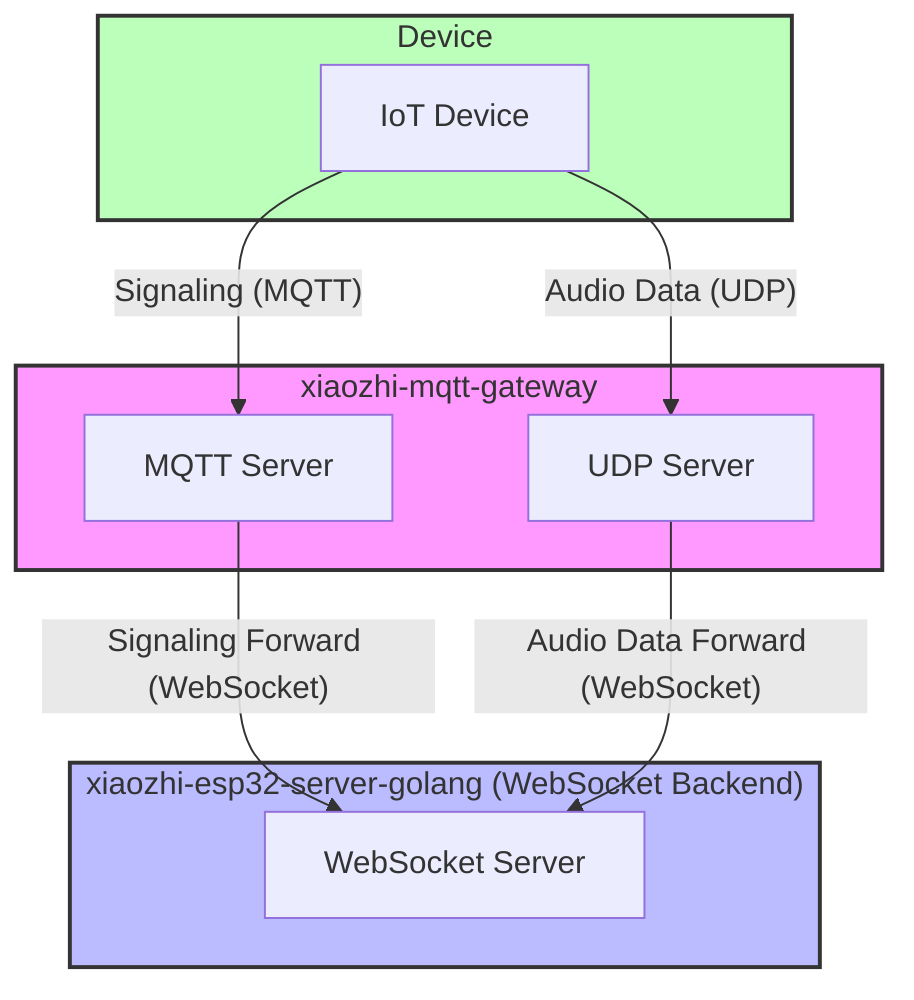

# MQTT UDP Bridge Configuration Guide

---

### Terminology Explanation

- **xiaozhi-mqtt-gateway:** Official mqtt udp bridge project by XiaGe, implements MQTT and UDP protocol to WebSocket conversion. This service allows devices to transmit control messages via MQTT protocol, while efficiently transmitting audio data via UDP protocol, and bridging these data to WebSocket service. [xiaozhi-mqtt-gateway](https://github.com/78/xiaozhi-mqtt-gateway) 
- **xiaozhi-esp32-server-golang:** This project

### Overall Architecture




## 1. MQTT UDP Bridge Configuration Guide

### Installation Steps
---
1. Clone repository
```
git clone 'https://github.com/78/xiaozhi-mqtt-gateway'
cd xiaozhi-mqtt-gateway
```
2. Install dependencies
```
npm install
```
3. Create configuration file
```
mkdir -p config
cp config/mqtt.json.example config/mqtt.json
```
4. Edit configuration file config/mqtt.json, set appropriate parameters

### Configuration Description
Configuration file config/mqtt.json needs to contain the following:
- `chat_servers`: Fill in Xiaozhi golang server IP and port, ***path must be /xiaozhi/mqtt_udp/v1/***
```
{
  "debug": false,
  "development": {
    "mac_addresss": ["aa:bb:cc:dd:ee:ff"],
    "chat_servers": ["ws://192.168.0.100:8989/xiaozhi/mqtt_udp/v1/"]
  },
  "production": {
    "chat_servers": ["ws://192.168.0.100:8989/xiaozhi/mqtt_udp/v1/"]
  }
}
```

### Environment Variables
Create .env file and set the following environment variables:
```
MQTT_PORT=1883              # MQTT server port
UDP_PORT=8884               # UDP server port
PUBLIC_IP=192.168.0.100     # Server public IP

#MQTT_SIGNATURE_KEY=mqtt_key # mqtt key, optional, if configured then mqtt authentication is performed, must be the same as the key configured in the websocket server
```

### Running

##### Development Environment

```
# Run directly
node app.js

# Run in debug mode
DEBUG=mqtt-server node app.js
```

---

## 2. Xiaozhi Golang Backend Service Configuration Guide


### 1. Key Configuration Items Description

#### Disable Local MQTT and UDP Servers
```yaml
mqtt:
  enable: false
  broker: "127.0.0.1"
  type: "tcp"
  port: 2883
  client_id: "xiaozhi_server"
  username: "admin"
  password: "test!@#"
```

#### OTA Configuration (Devices obtain connection parameters through OTA)
- `ota.signature_key`: Must be the same as ***MQTT_SIGNATURE_KEY*** in xiaozhi-mqtt-bridge .env file
- `test`/`external`: Internal/external environment distinction
- `websocket.url`: Returned WebSocket service address
- `mqtt.endpoint`: MQTT service address and port
- `mqtt.enable`: Whether to enable MQTT (when true, devices prefer MQTT+UDP)


```yaml
ota:
  signature_key: "mqtt_key"
  test:
    websocket:
      url: "ws://192.168.208.214:8989/xiaozhi/v1/"
    mqtt:
      enable: true
      endpoint: "192.168.208.214:5883"
  external:
    websocket:
      url: "wss://www.tb263.cn:55555/go_ws/xiaozhi/v1/"
    mqtt:
      enable: true
      endpoint: "mqtt.youdomain.cn"
```
---

## 3. Reference Documentation
- [mqtt_udp.md](./mqtt_udp.md) (Detailed architecture, configuration, flow)
- [mqtt_udp_protocol.md](./mqtt_udp_protocol.md) (Protocol and data flow)
- [config.md](./config.md) (Detailed configuration item description)
