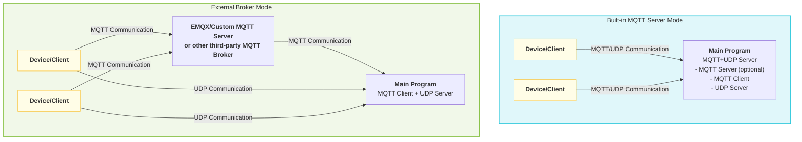

# MQTT UDP Server Configuration Guide

This project implements a **custom MQTT+UDP server** for efficiently handling data transmission such as audio between devices and the server. The architecture is flexible, supporting multiple deployment and replacement methods to accommodate different business scenarios.

## 1. Architecture Features and Flexibility

- **Custom MQTT+UDP Server**: The project includes a built-in complete MQTT protocol server and UDP audio channel. Devices establish sessions via MQTT, with subsequent data transmitted over UDP, balancing reliability and real-time performance.
- **MQTT Server Deployment Options**:
  - Can be started as part of the main program (server), suitable for all-in-one deployment.
  - Can also be deployed as a standalone process for horizontal scaling and resource isolation.
- **Third-Party MQTT Server Support**:
  - The project architecture supports replacing the built-in MQTT server with third-party MQTT brokers such as EMQX or custom MQTT servers.
  - Simply adjust the `mqtt` related parameters in the configuration file, and the main program acts as a pure client connecting to an external broker, suitable for large-scale clusters and high availability scenarios.
- **Support for the official xiaoge xiaozhi-mqtt-gateway project**
  - Adapted to the xiaoge xiaozhi-mqtt-gateway open-source project for integration
  - [See mqtt_bridge.md for details](./mqtt_bridge.md)

### Deployment Architecture Diagram

The diagram below shows two typical deployment methods to help understand the project's flexible architecture:



**Notes:**
- <b>Built-in MQTT Server Mode</b>: The main program integrates both the MQTT server and UDP server. Devices communicate directly with the main program.
- <b>External Broker Mode</b>: The main program acts only as an MQTT client connecting to an external broker such as EMQX or a custom MQTT server. Devices forward MQTT messages through the broker, while UDP data still connects directly to the main program.

## 2. Configuration File Settings
In `config/config.yaml`, pay attention to the following parameters:
- `mqtt`: **Client role**, used to configure this service as an MQTT client connecting to a broker (whether built-in or external).
  - `broker`, `type`, `port`, `client_id`, `username`, `password`
- `mqtt_server`: Built-in MQTT server parameters (only needs to be enabled when the main program runs the built-in server)
  - `enable`, `listen_host`, `listen_port`, `tls`, etc.
- `udp`: UDP channel parameters
  - `external_host`, `external_port`, `listen_host`, `listen_port`

## 3. OTA Configuration

OTA (Over-the-Air) configuration is used for devices to remotely obtain server, MQTT, WebSocket, and other connection information, as well as firmware upgrade and activation parameters. Depending on the device's network environment (e.g., intranet/public network), different OTA configuration information can be returned automatically.

- Configuration location: `config/config.yaml` in the `ota` field.
- Typical structure:
  ```yaml
  ota:
    test:
      websocket:
        url: "ws://192.168.208.214:8989/xiaozhi/v1/"
      mqtt:
        enable: false
        endpoint: "192.168.208.214"
    external:
      websocket:
        url: "wss://www.tb263.cn:55555/go_ws/xiaozhi/v1/"
      mqtt:
        enable: false
        endpoint: "www.youdomain.cn"
  ```
- Main parameter descriptions:
  - `test`: OTA return information for intranet/test environments.
  - `external`: OTA return information for public network/production environments.
  - `websocket.url`: WebSocket service address obtained by the device via OTA.
  - `mqtt.endpoint`: MQTT server address obtained by the device via OTA.
  - `mqtt.enable`: Whether to enable MQTT (can be used for dynamic switching).
- Typical use cases:
  - When a device starts up for the first time or upgrades, it obtains the latest server connection information and firmware information through the OTA interface.
  - Supports automatically distinguishing between intranet and public network based on device IP, returning different connection parameters to facilitate test and production environment isolation.

**Notes:**
- The OTA interface is typically at `/xiaozhi/ota/` and requires the corresponding route to be opened on the WebSocket server.
- Devices need to include `Device-Id` and `Client-Id` in the request headers.
- Can be combined with an activation mechanism to return activation codes, challenge codes, and other information to enhance device security.

## 4. Startup and Running Process

1. **Service Initialization**
   When starting the main program, it automatically initializes WebSocket, MQTT Server (optional), and the MQTT UDP service according to the configuration.
2. **MQTT+UDP Service Startup Process**
   - Read the mqtt and udp parameters from the configuration file.
   - If `mqtt_server.enable=true`, start the built-in MQTT server; otherwise, connect only as a client to an external broker.
   - Start the UDP server, listening on `udp.listen_port`, exposing `udp.external_host:external_port` externally.
   - Create an MQTT client (**client role**), connecting to the configured broker.
   - When a device connects to the built-in `mqtt_server`, the server will pre-create or reuse MQTT transport via lifecycle messages, and best-effort warm up device-side MCP.
   - After the client sends a `hello` message via MQTT, the server returns chat-level parameters such as `audio_params` and UDP info, establishes a UDP session, and subsequent data such as audio is transmitted through the UDP channel.

## 5. Configuration Examples

**Built-in MQTT Server Mode** (all-in-one deployment)
```yaml
mqtt:
  broker: "127.0.0.1"
  type: "tcp"
  port: 2883
  client_id: "xiaozhi_server"
  username: "admin"
  password: "test!@#"
mqtt_server:
  enable: true
  listen_host: "0.0.0.0"
  listen_port: 2883
udp:
  external_host: "127.0.0.1"
  external_port: 8990
  listen_host: "0.0.0.0"
  listen_port: 8990
ota:
  test:
    websocket:
      url: "ws://192.168.208.214:8989/xiaozhi/v1/"
    mqtt:
      enable: false
      endpoint: "192.168.208.214"
  external:
    websocket:
      url: "wss://www.tb263.cn:55555/go_ws/xiaozhi/v1/"
    mqtt:
      enable: false
      endpoint: "www.youdomain.cn"
```

**Connecting to an External MQTT Broker (e.g., EMQX/Custom MQTT Server)**
```yaml
mqtt:
  broker: "emqx.example.com"
  type: "tcp"
  port: 1883
  client_id: "xiaozhi_server"
  username: "admin"
  password: "test!@#"
mqtt_server:
  enable: false
udp:
  external_host: "Public IP"
  external_port: 8990
  listen_host: "0.0.0.0"
  listen_port: 8990
ota:
  test:
    websocket:
      url: "ws://192.168.1.100:8989/xiaozhi/v1/"
    mqtt:
      enable: false
      endpoint: "192.168.1.100"
  external:
    websocket:
      url: "wss://emqx.example.com/go_ws/xiaozhi/v1/"
    mqtt:
      enable: false
      endpoint: "emqx.example.com"
```

## 6. Recommended Scenarios
- **All-in-one deployment**: Suitable for small to medium scale, single machine, or containerized scenarios. Simple configuration and easy maintenance.
- **Distributed/cluster deployment**: Recommend disabling the built-in MQTT server and using a high-availability broker such as EMQX. The main program acts only as a client for elastic scaling and load balancing.

---

**Brief Process**: Configuration file settings → Service startup automatically loads configuration → Start UDP listener and MQTT connection → Create or reuse transport and warm up MCP on device MQTT online → Client establishes chat-level UDP session via MQTT `hello`.

## 7. Topic Definition and Mapping for Connecting to Third-Party MQTT Servers like EMQX

When connecting to third-party MQTT brokers such as EMQX, follow the topic definition and mapping rules below to ensure smooth data communication between devices and the server:

### Device-Side Topic Definition
- **public**: `device-server`
  > When the device publishes a message, the server automatically maps it to `/p2p/device_public/{mac_addr}`, where `{mac_addr}` is the device's MAC address.
- **sub**: `null`
  > Devices do not need to subscribe proactively; the server automatically subscribes to `/p2p/device_sub/{mac_addr}` on their behalf.

### Server-Side Topic Definition
- **public**: `/p2p/device_sub/{mac_addr}`
  > When the server sends a message to a specific device, it publishes to this topic.
- **sub**: `/p2p/device_public/#`
  > The server needs to subscribe to this wildcard topic to receive messages from all devices.
- **lifecycle**: `/p2p/device_public/_server/lifecycle`
  > The built-in `mqtt_server` publishes lifecycle events via this retained topic when devices connect or disconnect, allowing the main program to maintain transport, online status, and MCP warm-up.

#### Topic Mapping Notes
- Device-side and server-side topics use an automatic mapping mechanism. Devices only need to use `device-server` without worrying about the actual P2P path. The server automatically converts topics based on the device MAC address.
- This mechanism facilitates large-scale device management and message isolation, improving system security and maintainability.

#### Example
- Device A (MAC: 11:22:33:44:55:66)
  - Device publishes: `device-server` → Server receives: `/p2p/device_public/11:22:33:44:55:66`
  - Server sends: `/p2p/device_sub/11:22:33:44:55:66`

- Server subscribes: `/p2p/device_public/#`, can receive upload messages from all devices.

- Lifecycle message example:
  - Topic: `/p2p/device_public/_server/lifecycle`
  - Payload:
    ```json
    {
      "type": "mqtt_lifecycle",
      "device_id": "11:22:33:44:55:66",
      "state": "online",
      "client_id": "GID_test@@@11_22_33_44_55_66@@@uuid",
      "ts": 1710000000000
    }
    ```

> **Note:**
> - The above topic mapping rules only apply when connecting to third-party MQTT brokers such as EMQX.
> - When using the built-in MQTT server, the main program still listens on `/p2p/device_public/#`, where `/p2p/device_public/_server/lifecycle` is a server-reserved topic. Do not reuse it for device business messages.

### EMQX Message Redirection Configuration

To implement automatic routing and forwarding of device messages, configure the following rules in EMQX:

#### 1. Auto-Subscription Configuration
- **topic**: `/p2p/device_sub/${clientid}`

#### 2. Message Re-publish
Add a new rule with the following configuration:

**SQL Rule**:
```sql
SELECT clientid, payload FROM "device-server"
```

**Configuration Parameters**:
- **Data Input**: `"device-server"`
- **Action Output Type**: `"Message Re-publish"`
- **topic**: `/p2p/device_public/${clientid}`
- **payload**: `${payload}`

## 8. MQTT UDP Data Flow

This section briefly introduces the overall data interaction flow between devices and the server via MQTT+UDP, including key steps such as session establishment, data upload, and delivery.

For detailed protocol and packet format, please refer to: [MQTT UDP Protocol and Data Flow Documentation](./mqtt_udp_protocol.md)

### Flow Overview
1. **Device starts up** and connects to the server via MQTT.
2. **Lifecycle warm-up**: The built-in `mqtt_server` publishes `/p2p/device_public/_server/lifecycle` when the device comes online. The main program creates or reuses transport, maps device online status, and best-effort warms up device-side MCP.
3. **Device sends `hello`**: The server responds and delivers chat-level parameters such as `audio_params`, UDP address, key, and nonce.
4. **Audio/data upload**: The device efficiently uploads data such as audio through the UDP channel.
5. **Server delivers commands**: If control commands need to be sent, they can be delivered via MQTT or UDP channel.
6. **Disconnect and retention**: When the device goes offline, a lifecycle offline event is published. The main program immediately maps the offline status but retains the existing transport for a retention period to avoid frequent creation and destruction from short reconnections.

### Lifecycle Events and `hello` Boundary
- MQTT lifecycle events handle connection-level resource maintenance, including transport pre-creation, online status mapping, MCP warm-up, and offline delayed reclamation.
- `hello` still handles only chat-level initialization, including `audio_params`, UDP negotiation, sampling parameters, and session-level state preparation.
- Existing signaling semantics such as `listen`, `abort`, and `goodbye` remain unchanged and still depend on `hello` completion.

> For detailed topic design, packet structure, state transitions, etc., please refer to [mqtt_udp_protocol.md](./mqtt_udp_protocol.md).
