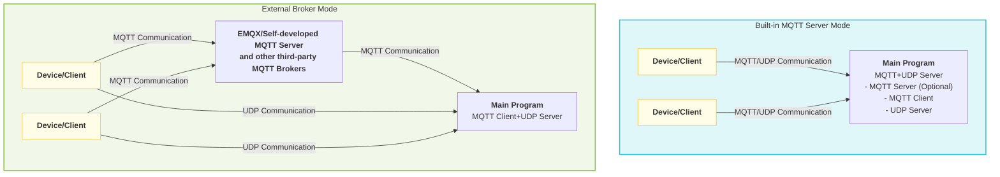

# MQTT UDP Server Configuration Process

This project implements a **proprietary MQTT+UDP server** for efficient audio and other data transmission between devices and server. The architecture is flexible, supporting multiple deployment and replacement methods to adapt to different business scenarios.

## 1. Architecture Features and Flexibility

- **Self-developed MQTT+UDP Server**: The project includes a complete MQTT protocol server and UDP audio channel, supporting devices to establish sessions via MQTT and subsequent data transmission via UDP, balancing reliability and real-time performance.
- **MQTT Server Optional Deployment Methods**:
  - Can be started as part of the main program (server) for integrated deployment.
  - Can also be deployed as a separate process for horizontal scaling and resource isolation.
- **Supports Third-party MQTT Servers**:
  - The project architecture supports replacing the built-in MQTT server with third-party MQTT Brokers such as EMQX or self-developed MQTT Server.
  - Just adjust `mqtt` related parameters in the configuration file, and the main program can act as a pure client to connect to external Brokers, suitable for large-scale clusters and high-availability scenarios.
- **Supports Official xiaozhi-mqtt-gateway Project Access**
  - Adapted to the xiaozhi-mqtt-gateway open source project, can be accessed and used
  - [See mqtt_bridge.md for details](./mqtt_bridge.md)

### Deployment Architecture Diagram

The following diagram shows two typical deployment methods to help understand the project's flexible architecture:



**Description:**
- <b>Built-in MQTT Server Mode</b>: Main program integrates MQTT server and UDP server, devices communicate directly with main program.
- <b>External Broker Mode</b>: Main program only acts as MQTT client connecting to EMQX or self-developed MQTT Server and other external Brokers, devices forward MQTT messages through Broker, UDP data still connects directly to main program.

## 2. Configuration File Settings
In `config/config.yaml`, pay attention to the following parameters:
- `mqtt`: **Client role**, used to configure this service as an MQTT client connecting to Broker (whether built-in or external Broker).
  - `broker`, `type`, `port`, `client_id`, `username`, `password`
- `mqtt_server`: Built-in MQTT server parameters (only needed when main program has built-in MQTT server)
  - `enable`, `listen_host`, `listen_port`, `tls`, etc.
- `udp`: UDP channel parameters
  - `external_host`, `external_port`, `listen_host`, `listen_port`

## 3. OTA Related Configuration

OTA (Over-the-Air) configuration is used for devices to remotely obtain server, MQTT, WebSocket and other connection information, as well as firmware upgrade, activation and other parameters. According to the device network environment (such as internal network/public network), different OTA configuration information can be automatically returned.

- Configuration location: `ota` field in `config/config.yaml`.
- Typical structure:
  ```yaml
  ota:
    test:
      websocket:
        url: "ws://192.168.208.214:8989/xiaozhi/v1/"
      mqtt:
        enable: false
        endpoint: "192.168.208.214"
    external:
      websocket:
        url: "wss://www.tb263.cn:55555/go_ws/xiaozhi/v1/"
      mqtt:
        enable: false
        endpoint: "www.youdomain.cn"
  ```
- Main parameter description:
  - `test`: OTA return information for internal network/test environment.
  - `external`: OTA return information for public network/production environment.
  - `websocket.url`: WebSocket service address obtained by device through OTA.
  - `mqtt.endpoint`: MQTT server address obtained by device through OTA.
  - `mqtt.enable`: Whether to enable MQTT (can be dynamically switched if needed).
- Typical uses:
  - When device starts for the first time or upgrades, obtain the latest server connection information and firmware information through OTA interface.
  - Supports automatic distinction between internal and external networks based on device IP, returning different connection parameters, facilitating isolation between test and production environments.

**Notes:**
- OTA interface is usually `/xiaozhi/ota/`, corresponding routes need to be opened on WebSocket server side.
- Devices need to bring `Device-Id` and `Client-Id` in request headers.
- Can be combined with activation mechanism to return activation code, challenge code and other information to enhance device security.

## 4. Startup and Operation Flow

1. **Service Initialization**  
   When starting main program, automatically initialize WebSocket, MQTT Server (optional), and mqtt udp service according to configuration.
2. **MQTT+UDP Service Startup Flow**  
   - Read mqtt and udp parameters from configuration file.
   - If `mqtt_server.enable=true`, start built-in MQTT server, otherwise only connect to external Broker as client.
   - Start UDP server, listen on `udp.listen_port`, expose `udp.external_host:external_port` externally.
   - Create MQTT client (**client role**), connect to configured Broker.
   - Client sends `hello` message via MQTT, server responds and establishes UDP session, subsequent audio and other data is transmitted through UDP channel.

## 5. Configuration Examples

**Built-in MQTT Server Mode** (Integrated deployment)
```yaml
mqtt:
  broker: "127.0.0.1"
  type: "tcp"
  port: 2883
  client_id: "xiaozhi_server"
  username: "admin"
  password: "test!@#"
mqtt_server:
  enable: true
  listen_host: "0.0.0.0"
  listen_port: 2883
udp:
  external_host: "127.0.0.1"
  external_port: 8990
  listen_host: "0.0.0.0"
  listen_port: 8990
ota:
  test:
    websocket:
      url: "ws://192.168.208.214:8989/xiaozhi/v1/"
    mqtt:
      enable: false
      endpoint: "192.168.208.214"
  external:
    websocket:
      url: "wss://www.tb263.cn:55555/go_ws/xiaozhi/v1/"
    mqtt:
      enable: false
      endpoint: "www.youdomain.cn"
```

**Connecting to External MQTT Broker (e.g., EMQX/Self-developed MQTT Server)**
```yaml
mqtt:
  broker: "emqx.example.com"
  type: "tcp"
  port: 1883
  client_id: "xiaozhi_server"
  username: "admin"
  password: "test!@#"
mqtt_server:
  enable: false
udp:
  external_host: "Public IP"
  external_port: 8990
  listen_host: "0.0.0.0"
  listen_port: 8990
ota:
  test:
    websocket:
      url: "ws://192.168.1.100:8989/xiaozhi/v1/"
    mqtt:
      enable: false
      endpoint: "192.168.1.100"
  external:
    websocket:
      url: "wss://emqx.example.com/go_ws/xiaozhi/v1/"
    mqtt:
      enable: false
      endpoint: "emqx.example.com"
```

## 6. Recommended Scenarios
- **Integrated Deployment**: Suitable for small to medium scale, single machine or containerized scenarios, simple configuration, easy maintenance.
- **Distributed/Cluster Deployment**: Recommend disabling built-in MQTT server, using EMQX and other high-availability Brokers, main program only acts as client to connect, facilitating elastic scaling and load balancing.

---

**Brief Flow**: Configuration file settings → Service startup automatically loads configuration → Start UDP listening and MQTT connection → Client establishes UDP session through MQTT hello.

## 7. Topic Definition and Mapping for Connecting to EMQX and Other Third-party MQTT Servers

When connecting to EMQX and other third-party MQTT Brokers, the following Topic definitions and mapping rules need to be followed to ensure smooth data communication between devices and server:

### Device-side Topic Definition
- **public**: `device-server`  
  > When device side publishes messages, the server side will automatically map it to `/p2p/device_public/{mac_addr}`, where `{mac_addr}` is the device's MAC address.
- **sub**: `null`  
  > Device side does not need to actively subscribe, server will automatically subscribe to `/p2p/device_sub/{mac_addr}` for it.

### Server-side Topic Definition
- **public**: `/p2p/device_sub/{mac_addr}`  
  > When server sends messages to specified device, it needs to publish to this Topic.
- **sub**: `/p2p/device_public/#`  
  > Server needs to subscribe to this wildcard Topic to receive messages reported by all devices.

#### Topic Mapping Description
- Device side and server side Topics use automatic mapping mechanism, devices only need to care about `device-server`, no need to care about actual P2P paths, server will automatically complete Topic conversion based on device MAC address.
- This mechanism facilitates large-scale device management and message isolation, improving system security and maintainability.

#### Example
- Device A (MAC: 11:22:33:44:55:66)
  - Device publishes: `device-server` → Server actually receives: `/p2p/device_public/11:22:33:44:55:66`
  - Server sends: `/p2p/device_sub/11:22:33:44:55:66`

- Server subscribes: `/p2p/device_public/#`, can receive messages reported by all devices.

> **Note:**
> - The above Topic mapping rules only take effect when connecting to EMQX and other third-party MQTT Brokers.
> - If using built-in MQTT server, Topics can be customized according to actual needs.

### EMQX Message Redirection Configuration

To achieve automatic routing and forwarding of device messages, the following rules need to be configured in EMQX:

#### 1. Auto-subscribe New Configuration
- **topic**: `/p2p/device_sub/${clientid}`

#### 2. Message Re-forwarding
Add a new item in rules, configure as follows:

**SQL Rule**:
```sql
SELECT clientid, payload FROM "device-server"
```

**Configuration Parameters**:
- **Data Input**: `"device-server"`
- **Action Output Type**: `"Message Republish"`
- **topic**: `/p2p/device_public/${clientid}`
- **payload**: `${payload}`

## 8. MQTT UDP Data Flow

This section briefly introduces the overall data interaction flow between devices and server through MQTT+UDP, including session establishment, data reporting and delivery and other key steps.

For detailed protocol and data packet format, please refer to: [MQTT UDP Protocol and Data Flow Documentation](./mqtt_udp_protocol.md)

### Flow Overview
1. **Device startup**, connects to server via MQTT, sends `hello` message.
2. **Server responds**, establishes UDP session, assigns session parameters.
3. **Audio/Data reporting**: Device efficiently uploads audio and other data through UDP channel.
4. **Server sends commands**: If control commands need to be sent, they can be completed through MQTT or UDP channel.
5. **Session maintenance and closure**: Supports heartbeat, timeout detection and other mechanisms to ensure connection stability.

> For detailed Topic design, data packet structure, state flow, etc., please refer to [mqtt_udp_protocol.md](./mqtt_udp_protocol.md).
