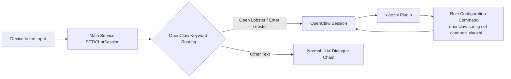

# OpenClaw Integration Guide

## Architecture Diagram

## Installation Steps

1. Ensure OpenClaw is running normally.
2. In the agent's `OpenClaw Settings` popup, copy the role configuration command. The system will automatically fill in the current service's WebSocket URL and the agent's JWT token.
3. Execute the following four commands in the OpenClaw console role configuration in sequence:
   `openclaw config set channels.xiaozhi.enabled true --strict-json`
   `openclaw config set channels.xiaozhi.url "{url}"`
   `openclaw config set channels.xiaozhi.token "{token}"`
   `openclaw gateway restart`
4. Replace `{url}` and `{token}` with the actual values copied from the popup, then execute `openclaw gateway restart` to make the configuration take effect.

## Usage Instructions

1. Click "Copy Command" in the agent's `OpenClaw Settings` popup.
2. Execute the copied four commands in the OpenClaw console role configuration to complete `enabled`, `url`, and `token` configuration, then restart the gateway.
3. After installation and configuration, you can call xiaozhi plugin capabilities in OpenClaw sessions.
4. Use "Send Test" in the `View OpenClaw` popup to verify connectivity and response.
5. On the device side, you can enter OpenClaw mode by saying `Open Lobster` / `Enter Lobster`, and exit the mode by saying `Close Lobster` / `Exit Lobster`.

## Troubleshooting Suggestions

- Status shows not connected: Confirm that `channels.xiaozhi.url` and `channels.xiaozhi.token` use the latest values, and `channels.xiaozhi.enabled` is set to `true`.
- Dialogue test timeout: Check if the four role configuration commands were executed successfully, if URL/token is correct, if `openclaw gateway restart` was executed, and if the OpenClaw session is online.
