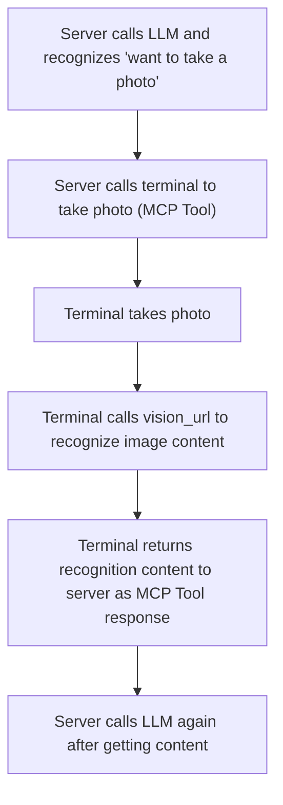

# Vision Recognition Configuration Process and Documentation

## 1. Feature Introduction

This system supports vision recognition functionality, primarily by calling external vision recognition services (such as Alibaba Cloud Qwen-VL, Volcano Doubao Vision, etc.) to achieve image understanding, content recognition, and other capabilities. Related parameters can be flexibly adjusted through configuration files.

## 2. Configuration File Location

Vision recognition related configuration files are located at:

- `config/config.yaml`: Main configuration file containing vision-related parameters.

## 3. Main Parameter Description

Vision configuration example in `config/config.yaml`:

```yaml
vision:
  enable_auth: false
  vision_url: "http://192.168.208.214:8989/xiaozhi/api/vision"
  vllm:
    provider: "aliyun_vision"
    aliyun_vision:
      type: "openai"
      model_name: "qwen-vl-plus-latest"
      base_url: "https://dashscope.aliyuncs.com/compatible-mode/v1"
      api_key: "api_key"
      max_token: 500
    doubao_vision:
      type: "openai"
      model_name: "doubao-1.5-vision-lite-250315"
      api_key: "api_key"
      base_url: "https://ark.cn-beijing.volces.com/api/v3"
      max_tokens: 500
```

- `enable_auth`: Whether to enable authentication for vision recognition interface.
- `vision_url`: **HTTP request address returned to client for image recognition**, client uploads images and gets recognition results through this address.
- `vllm.provider`: Specifies the current vision recognition service (e.g., aliyun_vision, doubao_vision).
- `aliyun_vision`/`doubao_vision`: Access parameters for various vision recognition services, including:
  - `type`: API type (e.g., OpenAI compatible interface).
  - `model_name`: Vision recognition model name used.
  - `base_url`: Service API address.
  - `api_key`: Service access key.
  - `max_token`/`max_tokens`: Maximum token count.

## 4. Configuration Process

1. According to actual needs, select and register required vision recognition services (such as Alibaba Cloud, Volcano Doubao, etc.), obtain API Key.
2. Edit `config/config.yaml`, fill in vision_url, provider, and corresponding service parameters under the `vision` field.
3. Start the service, check logs to confirm vision recognition module loaded successfully.
4. Upload images through API or frontend pages to verify recognition effect.

## 5. FAQ and Troubleshooting

- **Interface access failure**: Check if `vision_url` is correct and if the service is started.
- **Authentication failure**: If authentication is enabled, check if `api_key` is correct and valid.
- **Abnormal recognition results**: Confirm provider and model name are filled correctly, API Key is valid, and external service is available.

---

If you need to supplement specific API calling methods, frontend integration instructions, or configuration for specific vision recognition services, please contact the developer.

## 6. Typical Process Steps and Flowchart

### Step Description
1. Server calls LLM and recognizes user intent as "want to take a photo".
2. Server sends photo command to terminal through MCP Tool.
3. Terminal takes photo after receiving the command.
4. Terminal recognizes image content through vision_url.
5. Terminal returns recognized image content to server as MCP Tool response.
6. After server gets photo and recognition results, it can call LLM again for subsequent processing.

### Flowchart

